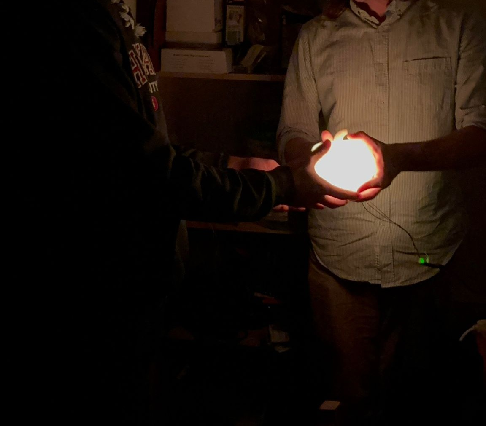

# pumpkin

This holds the CAD and code for the 2025 Best Pumpkin award for an annual pumpkin carving contest. The award was a light up, 3d-printed pumpkin!

  
  

## hardware

We use Adafruit 8mm Neopixel diffused individual RGB LEDs. We made a small circuit board using wire to connect neopixels and putting in JST connectors to connect from the circuit board to an Arduino Nano that also serves as power supply.

## software

We use the Arduino IDE to write, build, and upload code to the Arduino Nano. It is a cross-platform user-friendly system to control the lights. To use, download Arduino [here](https://support.arduino.cc/hc/en-us/articles/360019833020-Download-and-install-Arduino-IDE), and open the `firmware.ino` file in the firmware folder using the Arduino IDE. Under tools>Board select Arduino Nano, tools>Processor select ATmega238P (old bootloader), then plug in the Arduino Nano to a USB port on the computer and select the COM port in tools>Port. From here, hit upload in Arduino and it will build and upload the code, the Arduino Nano should reset itself upon upload and run the new code.

To drive the LEDs and select colors/animations, we use the FastLED library [here](https://fastled.io/).